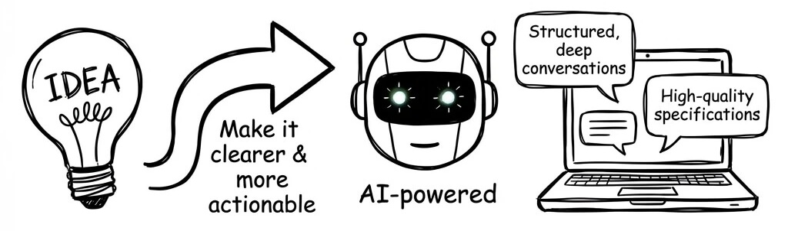
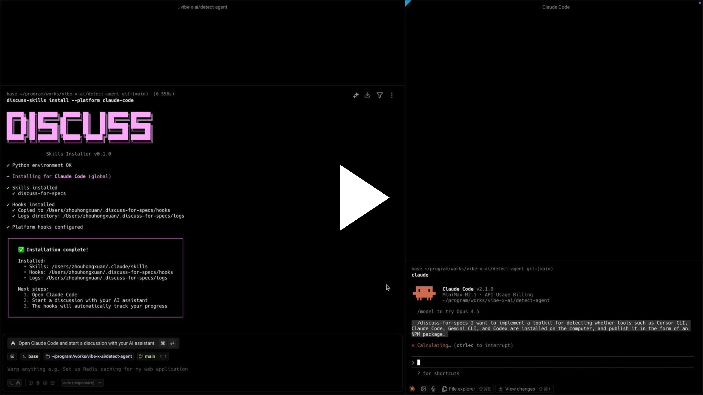

# Skill Discuss for Specs

> 每当你有一个想法，希望让它变得更清晰、更具可执行性时，使用这个项目。

一个由 AI 驱动的讨论促进系统，通过结构化的深度对话帮助你生成高质量的技术规范。



> 点击下方图片观看演示视频

[](https://s16-def.ap4r.com/kos/s101/nlav112218/mengshou/use-discuss-for-specs.0242e2cac0963606.mp4)

---

## 💡 问题背景

在 **规范驱动开发(SDD)** 中，生成高质量规范是一个众所周知的难题：

- **好的规范很强大**：完整、丰富的规范能显著提升代码生成质量、任务完成率，并使解决更高复杂度的问题成为可能
- **但创建它们很难**：高效生成全面、深思熟虑的规范仍然很困难且认知负荷高
- **缺失的环节**：如何在不造成认知负荷过重的情况下生成高质量规范？

---

## 🎯 解决方案：讨论模式

本项目引入了**讨论模式**——一种由 AI 促进的对话方式，帮助你迭代式地开发清晰、可执行的技术规范。它解决了三个关键问题：

### 1. AI 驱动的主动性

AI Agent 积极推动讨论向前发展：

- **AI 提议**：持续提供解决方案、替代方案和想法
- **人类决策**：你只需要选择、确认或回答问题
- **引导式完善**：通过这个引导过程，自然地深化和完善技术解决方案
- **降低认知负荷**：你保持在决策者角色，AI 处理繁重的思考工作

### 2. 状态管理与进度追踪

在深度讨论中永不迷失方向：

- **维护上下文**：通过结构化大纲持续追踪讨论状态
- **决策沉淀**：自动捕获并文档化已确认的决策
- **进度感知**：始终知道你在哪里，还有哪些问题待解决
- **不丢失细节**：深度、长期的讨论保持有序，无需费力
- **低成本深度**：可以进行全面探索，无需担心丢失线索

### 3. 渐进式增强

灵活适应你的工作流程：

- **随时开始**：在规范生成前、开发中、调试时或分析问题时
- **可控深度**：随时退出并沉淀决策，或继续讨论直到每个细节 100% 确认
- **始终相关**：无论你只有一个模糊想法还是具体挑战，都有效

---

## 👀 看到差异

### 对话流程

**没有讨论模式** - 你驱动一切：

```
你 ──────►  "我需要设计一个缓存系统。我在考虑使用 Redis，
             但对 TTL 策略不确定。应该使用惰性过期还是主动过期？
             另外，缓存失效模式呢？还有...
             我需要考虑读写比例..."

             (你必须自己想出所有问题)
             (你必须组织自己的思路)
             (你必须推动对话)
                       │
                       ▼
AI ────►  [回答你问的问题]
                       │
                       ▼
你 ──────►  "好的，但是关于...等等，我忘了问..."

             (你需要记住一切)
             (你需要发现所有边界情况)
             (你可能会错过重要方面)
                       │
                       ▼
                     .....

😓 高认知负荷：你思考、你提问、你追踪、你记忆
```

**有讨论模式** - AI 驱动，你决策：

```
你 ──────►  "设计一个缓存系统"  (就这样。只是主题。)
                       │
                       ▼
AI ────►  "让我先理解一下问题空间。

             💡 缓存的主要驱动力是什么？
                - 性能优化？
                - 成本降低？
                - 可靠性提升？

             💡 我注意到我们应该尽早明确读写比例 -
                这从根本上影响架构选择。

             ❓ 这是读多写少还是写多读少？"
                       │
                       ▼
你 ──────►  "读多写少，用于 API 响应"  (简单回答)
                       │
                       ▼
AI ────►  "很好。对于读多的 API 缓存，你可能没考虑过：

             💡 Cache-aside vs Read-through 模式在失效复杂度上
                有很大不同。让我解释一下权衡...

             ┌────────────── 进度追踪 ──────────────┐
             │ ✅ 已确认：读多 API 缓存             │
             │ 🔄 讨论中：缓存模式选择             │
             │ 📋 待定：TTL 策略、失效机制          │
             └──────────────────────────────────────┘"
                       │
                       ▼
你 ──────►  "第一个"  (简单选择)
                       │
                       ▼
                     .....

😊 低认知负荷：AI 思考、AI 提问、AI 追踪、你决策
```

### 输出对比

| ❌ 没有讨论模式 | ✅ 有讨论模式 |
|:--------------|:-------------|
| 📜 只有聊天历史 | 📁 `discuss/caching-system/` |
| (向上滚动查找内容) | ├── 📋 `outline.md` (实时进度) |
| (信息散落在对话中) | ├── 📊 `meta.yaml` (轮次计数) |
| • 决策 1... 在某处 | └── 📄 `decisions/` |
| • 决策 2... 可能忘了 | &nbsp;&nbsp;&nbsp;&nbsp;├── `01-cache-pattern.md` |
| • 决策 3... 哪一轮？ | &nbsp;&nbsp;&nbsp;&nbsp;├── `02-storage-choice.md` |
| • 我们覆盖所有内容了吗？ | &nbsp;&nbsp;&nbsp;&nbsp;└── `03-ttl-strategy.md` |
| • 还有什么待定？ | &nbsp;&nbsp;&nbsp;&nbsp;└── (每个决策独立归档) |
|  |  |
| ❌ 没有结构 | ✅ 结构化且可搜索 |
| ❌ 容易迷失方向 | ✅ 无信息丢失 |
| ❌ 难以后续恢复 | ✅ 随时恢复 |

---

## 🔍 讨论模式 vs Spec

讨论模式**不是用来替代 Spec** 的，它是 Spec 的**上游决策层**，让 Spec 更容易写、更可靠。

|  | 讨论模式 | Spec |
|--|---------|------|
| **关注点** | 过程（探索、决策） | 产物（文档、执行） |
| **核心问题** | "要决策什么？为什么？" | "要做什么？怎么做？" |
| **主要产出** | `outline.md` + `decisions/` | 结构化规范文档 |
| **适用时机** | 不确定性高时 | 决策已清晰时 |

### 在 SDD 中的工作流

```
讨论 → 沉淀决策 → 生成/更新 Spec → 实现 → (需要时回到讨论)
```

本项目**工具无关**：可以和你现有的任何 Spec 模板、IDE 流程或 Spec 生成器组合使用。

---

## 🔧 使用场景

每当需要澄清和完善想法时，使用讨论模式：

| 场景 | 什么时候用 | 如何帮助 |
|------|-----------|---------|
| **技术方案设计** | "我要设计一个缓存系统，怎么做呢？" | 探索架构、评估权衡、达成清晰决策 |
| **问题诊断** | "线上有个性能问题，该如何解决？" | 系统性分析问题、追踪假设、文档化发现 |
| **技术选型** | "Redis 还是 Memcached？要不要上 Kafka？" | 比较选项、评估适配性、做出明智选择 |
| **产品设计** | "这个功能的用户流程应该怎么设计？" | 完善需求、探索用户流程、文档化决策 |
| **规范生成** | "我有个技术设想但还没想清楚，该怎么细化呢？" | 将粗略想法转化为全面、可执行的技术规范 |

---

## ✨ 技术特性

- **单一技能架构**：统一的 `discuss-for-specs` Skill，模板分离便于维护
- **智能沉淀**：自动检测未沉淀决策，可配置提醒
- **基于 Hook 的自动化**：流程工作（轮次计数、状态检查）由 Python 脚本处理，而非 AI
- **多平台支持**：支持多个 AI 编程助手（见下表）
- **结构化追踪**：问题生命周期管理、趋势分析和收敛检测
- **跨平台设计**：共享技能内容，平台特定适配

---

## 🔌 平台支持

| 平台 | 状态 | 级别 | 安装命令 |
|------|:----:|:----:|----------|
| **Claude Code** | ✅ 就绪 | L2 | `npx @vibe-x/discuss-for-specs install --platform claude-code` |
| **Cursor** | ✅ 就绪 | L2 | `npx @vibe-x/discuss-for-specs install --platform cursor` |
| **Kilocode** | ✅ 就绪 | L1 | `npx @vibe-x/discuss-for-specs install --platform kilocode` |
| **OpenCode** | ✅ 就绪 | L1 | `npx @vibe-x/discuss-for-specs install --platform opencode` |
| **Codex CLI** | ✅ 就绪 | L1 | `npx @vibe-x/discuss-for-specs install --platform codex` |
| Cline | 🔜 计划中 | L2 | - |
| Windsurf | 🔜 计划中 | - | - |

### L1 和 L2 有什么区别？

| 功能 | L1 平台 | L2 平台 |
|------|:-------:|:-------:|
| 讨论引导 | ✅ | ✅ |
| 进度追踪 | ✅ | ✅ |
| 决策沉淀 | ✅ | ✅ |
| **自动提醒 Hooks** | ❌ | ✅ |

- **L2 平台**（Claude Code、Cursor）支持 hooks，自动提醒你沉淀决策
- **L1 平台**（Kilocode、OpenCode、Codex）拥有完整讨论功能，但需要手动追踪决策

> 💡 详细架构和 Hook 机制请参阅 [工作原理](docs/HOW-IT-WORKS-zh.md)。

---

## 🚀 快速开始

### 安装

选择最适合你的安装方式：

#### 方式一：npx（推荐 - 无需安装）

```bash
# 自动检测平台
npx @vibe-x/discuss-for-specs install

# 或指定平台
npx @vibe-x/discuss-for-specs install --platform claude-code
```

#### 方式二：全局安装（经常使用推荐）

```bash
npm install -g @vibe-x/discuss-for-specs
discuss-for-specs install --platform cursor
```

#### 方式三：curl（轻量级，仅技能）

适用于没有 Node.js 环境或只需要核心技能的场景：

```bash
# 自动检测平台
curl -fsSL https://raw.githubusercontent.com/vibe-x-ai/skill-discuss-for-specs/main/install.sh | bash

# 或指定平台
curl -fsSL https://raw.githubusercontent.com/vibe-x-ai/skill-discuss-for-specs/main/install.sh | bash -s -- -p cursor

# 列出所有支持的平台
curl -fsSL https://raw.githubusercontent.com/vibe-x-ai/skill-discuss-for-specs/main/install.sh | bash -s -- --list
```

> ⚠️ **注意**：curl 安装仅安装技能（无 hooks）。如需 L2 功能（自动提醒），请使用 npm。

### 前置要求

- **Node.js** 16+（npm 安装需要）
- **Python** 3.8+，安装 PyYAML（hooks 需要，安装时自动检查）

### 开始讨论

安装完成后，只需告诉你的 AI：

> "进入讨论模式。我想讨论 [你的主题]。"

或英文：

> "Enter discussion mode. I want to design [your topic]."

Agent 将引导你进行结构化对话，自动追踪决策和进度。

### 卸载

```bash
npx @vibe-x/discuss-for-specs uninstall --platform cursor
```

---

## 📁 项目结构

```
skill-discuss-for-specs/
├── skills/              # 📝 技能源码（供 AI 使用的 Markdown）
│   └── discuss-for-specs/          # 单一合并的讨论技能
│       ├── SKILL.md                # 核心技能内容
│       ├── headers/                # 平台特定的 YAML 头
│       └── references/             # 模板和参考文档
├── hooks/               # ⚡ 自动化脚本（Python）
│   ├── stop/                # 沉淀检测 Hook（基于快照）
│   └── common/              # 共享工具
├── npm-package/         # 📦 NPM 发布包（唯一构建入口）
│   ├── dist/                # 所有平台的构建产物
│   ├── hooks/               # 打包的 hooks（构建时复制）
│   └── src/                 # CLI 源码
├── install.sh           # 🔌 通用 curl 安装脚本（自动检测平台）
├── config/              # ⚙️ 配置模板
└── .discuss/            # 💬 讨论归档（示例）
```

> **说明**：所有技能构建通过 `npm-package/scripts/build.js` 完成。
> `install.sh` 脚本从 `npm-package/dist/` 下载资源。

> **说明**：所有技能构建通过 `npm-package/scripts/build.js` 完成。
> `platforms/` 目录只包含安装脚本，它们从 `npm-package/dist/` 下载资源。

---

## 📚 文档

- **[工作原理](docs/HOW-IT-WORKS-zh.md)** - 架构、Hooks 和内部机制
- [架构设计讨论](.discuss/2026-01-17/skill-discuss-architecture-design/outline.md) - 讨论模式实际运行示例
- [决策记录](.discuss/2026-01-17/skill-discuss-architecture-design/decisions/) - 已文档化的架构决策
- [AGENTS.md](AGENTS.md) - 与此系统协作的 AI 指南

---

## 🔧 配置

配置存储在 `.discuss/.snapshot.yaml` 中。默认阈值：

```yaml
version: 1
config:
  stale_threshold: 3      # outline 变更几次后轻柔提醒
```

更多配置选项详见 [工作原理](docs/HOW-IT-WORKS-zh.md#snapshotyaml)。

---

## 🛠️ 开发

### 前置要求

- Node.js 16+
- Python 3.8+

### 设置

```bash
# 安装 npm 依赖
cd npm-package && npm install

# 构建发布包
npm run build

# 运行 Python 测试
cd .. && python -m pytest tests/
```

### CLI 命令

```bash
# 列出支持的平台
npx @vibe-x/discuss-for-specs platforms

# 带选项安装
npx @vibe-x/discuss-for-specs install --platform cursor --skip-hooks
npx @vibe-x/discuss-for-specs install --platform claude-code --skip-skills

# 卸载
npx @vibe-x/discuss-for-specs uninstall --platform cursor
```

---

## 🤝 贡献

欢迎贡献！这是 V1 - 基础版本。我们根据实际使用情况进行迭代。

---

## 📄 许可证

[MIT License](LICENSE)

---

## 🙏 致谢

基于 Claude Skills 生态系统、规范驱动开发实践和跨平台 IDE 扩展架构的见解构建。

---

**版本**：0.1.0
**状态**：V1 - 基础版本
**理念**：通过 AI 引导的结构化讨论，将粗略想法转化为可执行规范。
